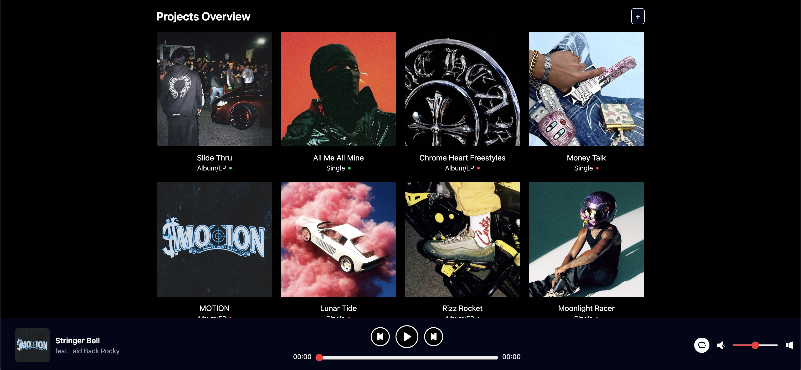
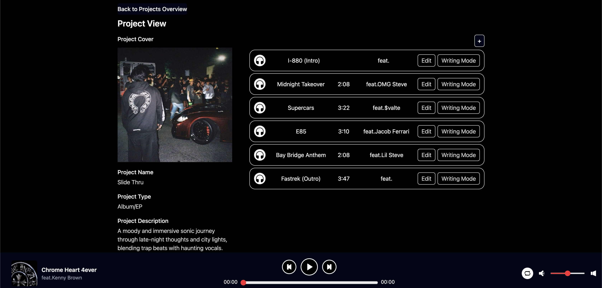

# Music Manager 

## Author
**Name**: Yachen Wang (Mason)  
**Class**: CS5610 - Web Development   

**Class Link**: https://johnguerra.co/classes/webDevelopment_spring_2025/  
**Design Doc**: https://docs.google.com/document/d/1M5H6b-8of2mzEQhMIb03A0gIjG1v7V405SAsRGxeqDU/edit?usp=sharing     
**Slides**: https://docs.google.com/presentation/d/1zUsMvfjdN0J591YvfGsvXg0_uD3G6Nhe3_geRnDE9lM/edit?usp=sharing  
**Demo**:  https://music-manager-obf2.vercel.app/   
**Video**: https://youtu.be/J9A7jvZbIM4  
**Wireframe**: https://www.figma.com/design/nuBMiwldwZXAxi7fLpHPEg/Untitled?node-id=0-1&t=gia474sT3jKBywSQ-1    
**Accessibility Report**:  

## Project Overview
**Music Manager** is a comprehensive web application designed to **help music professionals organize their music projects and tracks in one centralized platform**. Built with **React**, **Node.js**, **Express.js**, and **MongoDB**, the app provides an intuitive interface for managing music production workflows. Users can create projects, upload instrumental tracks, add lyrics, and track collaborators for each song. The application also features a built-in audio player that allows users to listen to their tracks directly within the platform, making it easy to review and share works in progress.

**Frontend Development**: HTML/CSS, JavaScript, React, Tailwind CSS   
**Backend Development**: Node.js, Express
**Database**: MongoDB, Cloudinary  
**Development Tools**: Trae & VS Code (with ESLint & Prettier)  
**Deployment**: Vercel  

## Screenshots
### Project Overview  
  

### Project View Page  
  

## Instructions to Build

***Option 1: Live Demo***  

https://music-manager-obf2.vercel.app/    
Backend deployed with Vercel. Database deployed with MongoDB Atlas.

***Option 2: Run Locally***  

**Step 1: Git clone this repository**  
git clone https://github.com/masonwangmason/music-manager.git

**Step 2: Navigate to the project directory**  
cd music-manager

**Step 3: Install dependencies**  
npm install

**Step 4: Create your .env file**  
Create a **.env** file in the root directory and add the following content:  

**PORT=3000**  
**MONGODB_URI=your_mongodb_connection_string**  

Replace **your_mongodb_connection_string** with your actual MongoDB connection string.

**Step 5: Run the server**  
npm start

**Step 6: Visit the following URL in your desired browser**  
http://localhost:3000

## License
This project is licensed under the MIT License. See the LICENSE file for details. 

## LLM Citation
Project structure and design insights:
- "Why is the node module file still in my GitHub after pushing, despite adding it to .gitignore?"
- "How can I enable users to edit entries by clicking on history cards?"
- "Can you assist in generating and inserting 1000+ database entries into MongoDB?"
- "How can I remove files from GitHub without deleting them locally?"
- "What steps should I take to troubleshoot a 500 error when fetching projects from the server?"
- "How can I update my deployed Vercel project using the command line?"
- "Can you help me center elements within a div using Tailwind CSS?"
- "How do I ensure my MongoDB connection is correctly established in my Node.js application?"